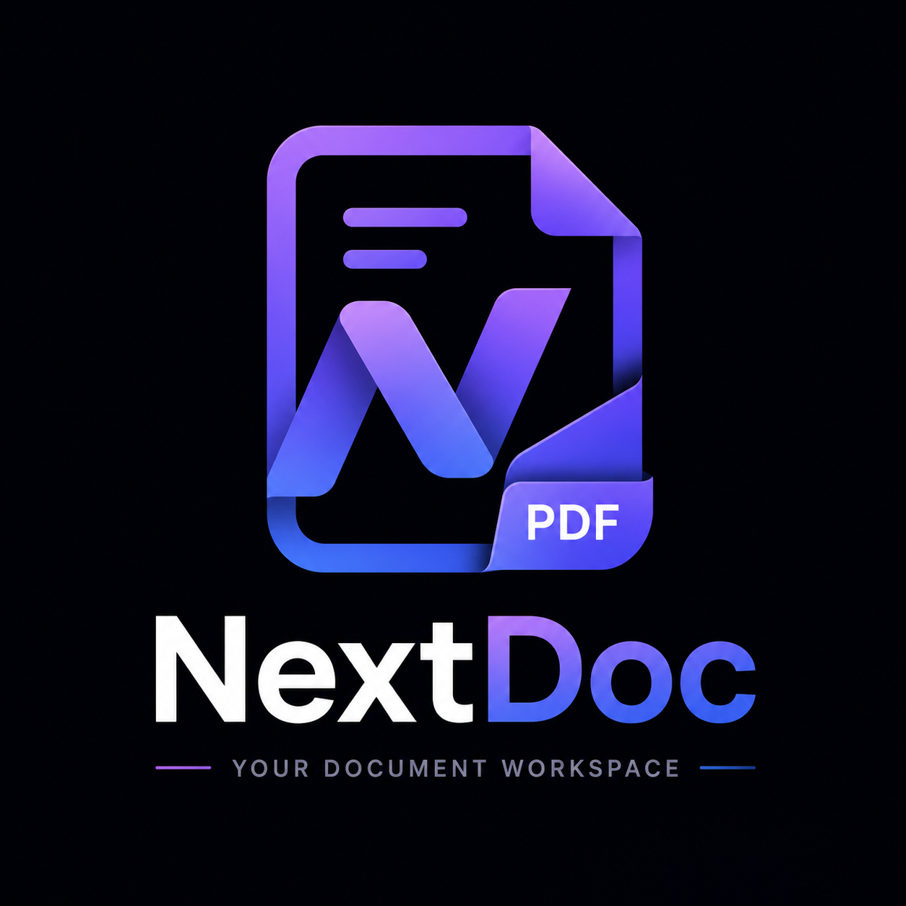
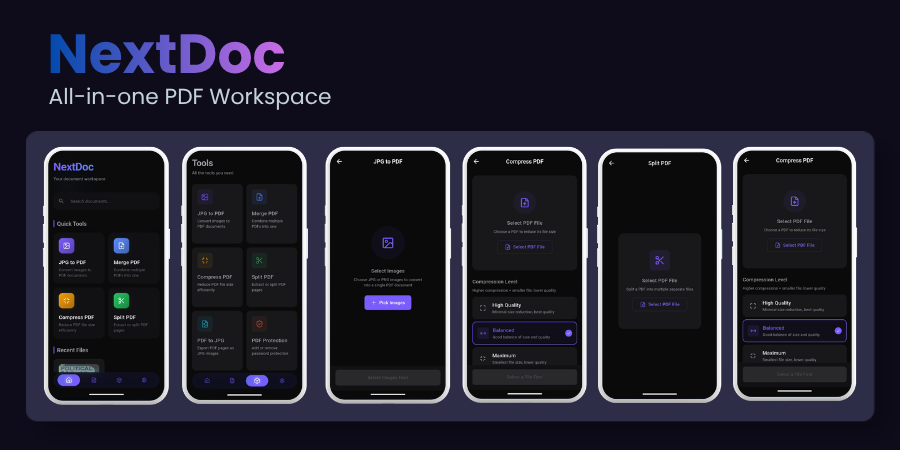
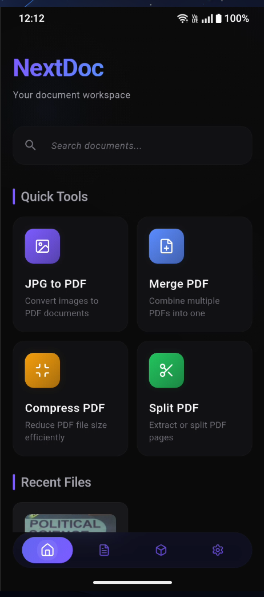
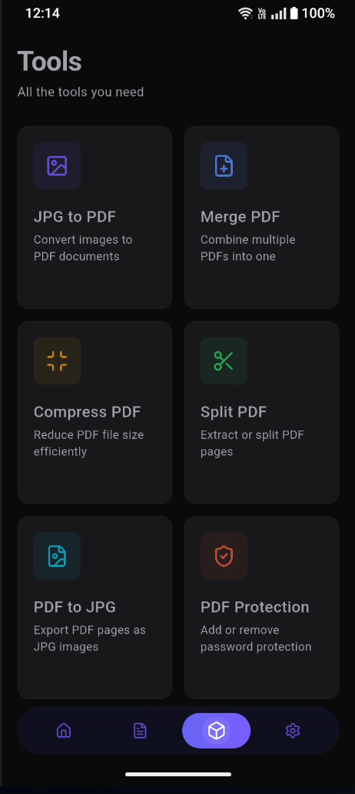
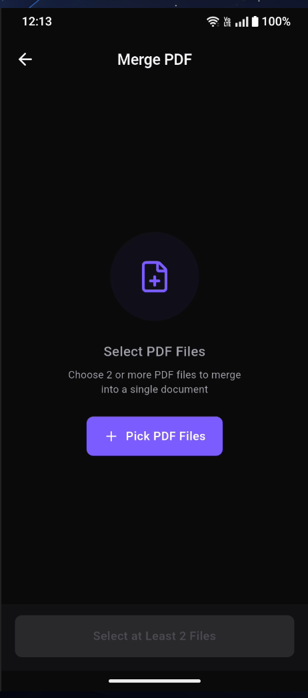
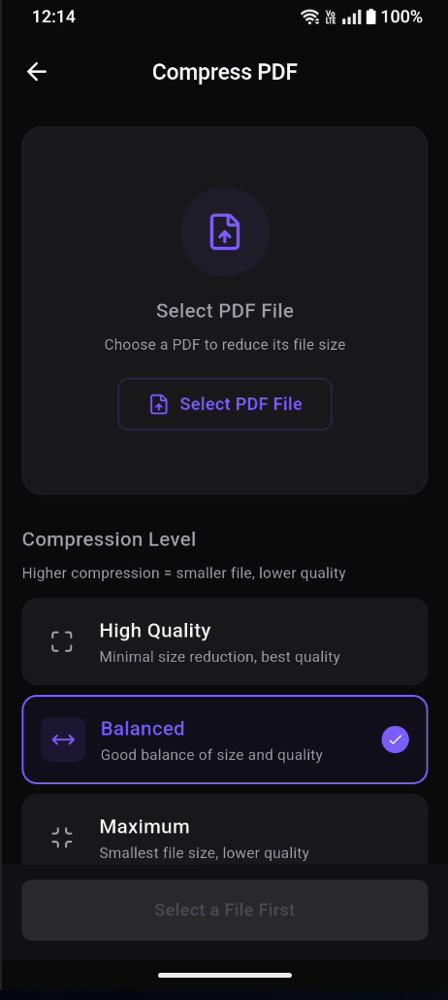

<p align="center">
  
</p>

<p align="center">
  <strong>Modern Document Management — All-in-One PDF & Image Tool</strong>
</p>

<p align="center">
  
  
  
  
</p>
<br>

<!-- ──────── Screenshot Banner ──────── -->

<p align="center">
  
</p>

<br>

---

## ✨ Features

<table>
  <tr>
    <td width="33%" align="center">
      <h3>🖼️ JPG → PDF</h3>
      <p>Select multiple images and combine them into a single PDF document with ordering, editing, and quality control.</p>
    </td>
    <td width="33%" align="center">
      <h3>📄 PDF → JPG</h3>
      <p>Extract every page of a PDF as a high-quality JPEG image — perfect for sharing or reusing individual pages.</p>
    </td>
    <td width="33%" align="center">
      <h3>🔗 Merge PDF</h3>
      <p>Combine multiple PDF files into one document. Reorder pages and edit individual files before merging.</p>
    </td>
  </tr>
  <tr>
    <td width="33%" align="center">
      <h3>✂️ Split PDF</h3>
      <p>Split a PDF into separate files by page ranges or extract every single page individually.</p>
    </td>
    <td width="33%" align="center">
      <h3>📦 Compress PDF</h3>
      <p>Reduce PDF file size with adjustable compression levels while maintaining acceptable quality.</p>
    </td>
    <td width="33%" align="center">
      <h3>🔐 PDF Protection</h3>
      <p>Add or remove password protection to keep your documents secure.</p>
    </td>
  </tr>
</table>

<br>

## 🎨 Editor Studio

Every tool integrates with **Editor Studio** — a unified editing workspace where you can:

<table>
  <tr>
    <td>✂️ <strong>Crop</strong></td>
    <td>Free-style crop with adjustable aspect ratios</td>
  </tr>
  <tr>
    <td>🔄 <strong>Rotate / Flip</strong></td>
    <td>90° rotation, horizontal & vertical flip</td>
  </tr>
  <tr>
    <td>🎭 <strong>Filters</strong></td>
    <td>Grayscale, sepia, negative, blur, sharpen, emboss, edge detect</td>
  </tr>
  <tr>
    <td>☀️ <strong>Adjustments</strong></td>
    <td>Brightness, contrast, saturation</td>
  </tr>
  <tr>
    <td>✍️ <strong>Signature</strong></td>
    <td>Draw, add text, or upload signature images</td>
  </tr>
  <tr>
    <td>💧 <strong>Watermark</strong></td>
    <td>Text watermark with adjustable font size, color, and opacity</td>
  </tr>
  <tr>
    <td>📑 <strong>Page Management</strong></td>
    <td>Reorder, duplicate, or delete pages</td>
  </tr>
</table>

<br>

<!-- ──────── Screenshots Grid ──────── -->

## 📸 Screenshots

<div align="center">
  <table>
    <tr>
      <td align="center"><br><em>Home Screen</em></td>
      <td align="center"><br><em>Tools</em></td>
      <td align="center"><br><em>Merge PDF</em></td>
      <td align="center"><br><em>Compress PDF</em></td>
    </tr>
  </table>
<<<<<<< HEAD
<<<<<<< HEAD
</div>
=======
</p>
>>>>>>> 783d649 (Fix: issue on document saving, now all the files (images/pdfs) will be saved in Internal Storage/Download/NextDoc folder)
=======
</div>
>>>>>>> b042096 (Update app code)

<br>

## 🛠️ Tech Stack

| | |
|---|---|
| **Framework** | Flutter 3.44+ (Dart) |
| **State Management** | Riverpod |
| **Navigation** | GoRouter |
| **PDF Rendering** | pdfx |
| **PDF Generation** | pdf (Dart) |
| **Image Processing** | image (Dart) + image_cropper |
| **File Handling** | file_picker |
| **Local Storage** | Isar Database |
| **Icons** | Lucide Icons |

<br>

## 🚀 Getting Started

### Prerequisites

- Flutter SDK 3.44+
- Dart SDK 3.7+
- Android Studio / VS Code

### Installation

```bash
# Clone the repository
git clone https://github.com/ASHIFCODES/nextdoc.git
cd nextdoc

# Install dependencies
flutter pub get

# Run the app
flutter run
```

### Build

```bash
# Android APK
flutter build apk --release

# Android App Bundle
flutter build appbundle --release

# iOS (macOS only)
flutter build ios --release
```

<br>

## 📁 Project Structure

```
lib/
├── core/
│   ├── constants/           # App colors, spacing, radius, typography
│   ├── models/              # Shared data models
│   ├── providers/           # Riverpod providers
│   ├── services/            # Business logic services
│   ├── theme/               # Theme configuration
│   └── widgets/             # Shared UI components
├── features/
│   ├── editor_studio/       # Unified PDF/image editor
│   │   ├── models/
│   │   ├── screens/
│   │   ├── services/
│   │   └── widgets/
│   ├── home/                # Home screen & recent files
│   ├── settings/            # Settings page
│   └── tools/               # Tool screens
│       ├── screens/         # JPG→PDF, PDF→JPG, Merge, Split, Compress, Protect
│       └── widgets/         # Tool-specific widgets
└── main.dart
```

<br>

## 📄 License

```
MIT License

Copyright (c) 2026 ASHIFCODES (lordhanya)

Permission is hereby granted, free of charge, to any person obtaining a copy
of this software and associated documentation files...
```

<br>

---

<p align="center">
  Made with ❤️ by <a href="https://github.com/ASHIFCODES">ASHIFCODES</a>
</p>
